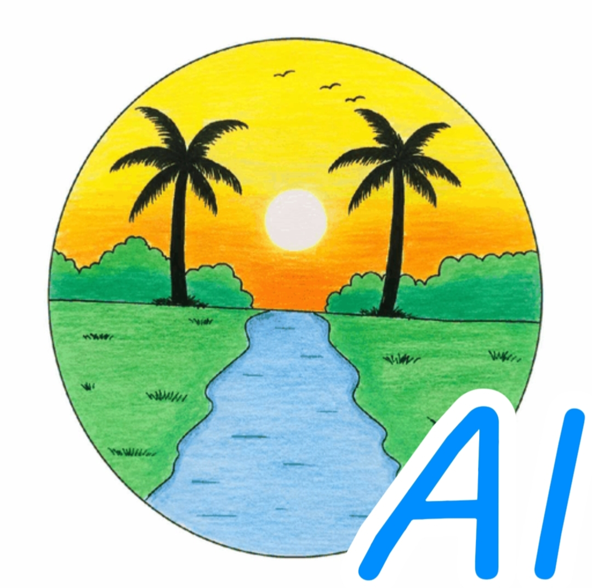

<!DOCTYPE html>
<html lang="ar" dir="rtl">

<head>

<meta charset="UTF-8">
<meta name="viewport" content="width=device-width, initial-scale=1.0">
<meta name="theme-color" content="#08142b">
<link rel="search" type="application/opensearchdescription+xml" href="opensearch.xml" title="Alislamiah AI">

<title>Alislamiah-AI Browser</title>

</head>

<body>

<!-- =====================================================
     MAIN APP (القسم الرئيسي)
===================================================== -->

    <!-- TOP BAR -->
    

        <button class="top-button" type="button" onclick="openMenu()">☰</button>
        
Alislamiah AI

    

    <!-- BRAND -->
    

        
Alislamiah-AI

        

    

    <!-- AI LOGO -->
    

        AI
    

    <!-- HERO -->
    

        <h1>Alislamiah AI Browser</h1>
        

        
الذكاء الاصطناعي • البحث • السرعة • الخصوصية

    

    <!-- SEARCH -->
    

        

            <button class="search-button" type="button" onclick="performSearch()">🔍</button>
            <input id="searchInput" class="search-input" type="text" autocomplete="off" placeholder="ابحث في الويب أو اطرح سؤالاً..." onkeydown="handleSearchKey(event)">
        

    

    <!-- SHORTCUT TITLE -->
    
الوصول السريع

    <!-- SHORTCUTS -->
    

        

            
▶️

            
YouTube

        

        

            
🤖

            
AI

        

        

            
🌐

            
Alislamiah

        

        

            
⭐

            
Favorites

        

        

            
⚙️

            
Settings

        

        

            
📖

            
Quran

        

    

    <!-- FOOTER -->
    

        <strong>Alislamiah AI Browser</strong> 2026 ©
    

<!-- =====================================================
     SIDE MENU
===================================================== -->

    

        

            <h2>Alislamiah AI</h2>
            <button class="close-menu" type="button" onclick="closeMenu()">✕</button>
        

        <button class="menu-item" type="button" onclick="window.location.href='index.html'; closeMenu();">🏠 الرئيسية</button>
        <button class="menu-item" type="button" onclick="goToShortcut('quran', 'Quran', 'quran.html', '')">📖 Quran</button>
        <button class="menu-item" type="button" onclick="goToShortcut('favorites', 'Favorites', 'favorites.html', '')">⭐ Favorites</button>
        <button class="menu-item" type="button" onclick="goToShortcut('ai', 'AI Assistant', 'results.html?shortcut=ai', ''); closeMenu();">🤖 AI</button>
        <button class="menu-item" type="button" onclick="window.location.href='Settings.html'">⚙️ Settings</button>
        <button class="menu-item" type="button" onclick="goToShortcut('alislamiah', 'Alislamiah', 'https://www.alislamiah.com', 'icon.png')">🌐 Alislamiah</button>
        <button class="menu-item" type="button" onclick="goToShortcut('youtube', 'YouTube', 'https://www.youtube.com', 'https://www.youtube.com/favicon.ico')">▶️ YouTube</button>
        <!-- رابط السجل المضاف هنا -->
        <button class="menu-item" type="button" onclick="window.location.href='history.html'; closeMenu();">🕒 History</button>
    

</body>
</html>
