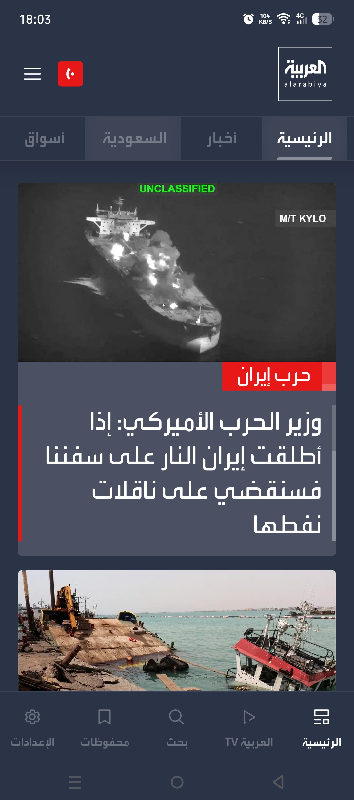
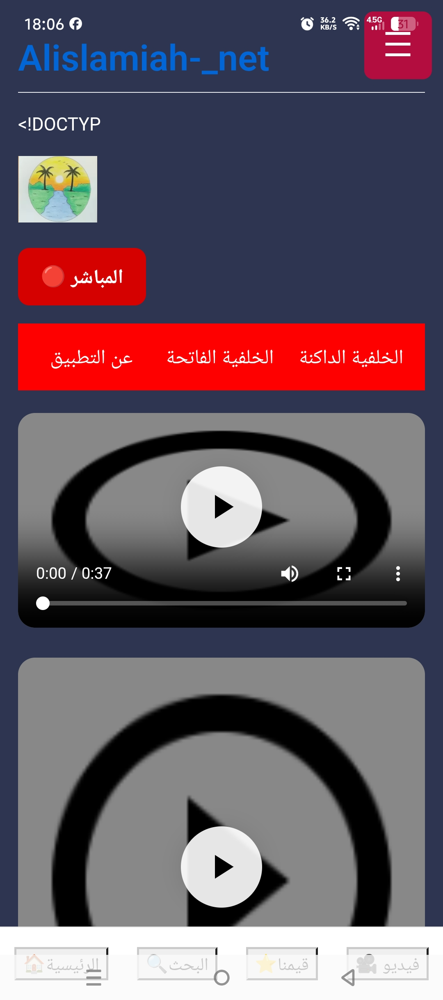

<!DOCTYPE html>
<html lang="ar" dir="rtl">

<head>

<meta charset="UTF-8">
<meta name="viewport" content="width=device-width, initial-scale=1.0">
<meta name="theme-color" content="#08142b">
<link rel="search" type="application/opensearchdescription+xml" href="opensearch.xml" title="Alislamiah AI">
<link rel="stylesheet" href="style.css">

<title>Alislamiah-AI Browser</title>

</head>

<body>

<!-- =====================================================
     MAIN APP (القسم الرئيسي)
===================================================== -->

    <!-- TOP BAR -->
    

        <button class="top-button" type="button" onclick="openMenu()">☰</button>
        
Alislamiah AI

    

    <!-- BRAND -->
    

        
Alislamiah-AI

        

    

    <!-- AI LOGO -->
    

        AI
    

    <!-- HERO -->
    

        <h1>Alislamiah AI Browser</h1>
        

        
الذكاء الاصطناعي • البحث • السرعة • الخصوصية

    

    <!-- SEARCH -->
    

        

            <button class="search-button" type="button" onclick="performSearch()">🔍</button>
            <input id="searchInput" class="search-input" type="text" autocomplete="off" placeholder="ابحث في الويب أو اطرح سؤالاً..." onkeydown="handleSearchKey(event)">
        

    

    <!-- SHORTCUT TITLE -->
    
الوصول السريع

    <!-- SHORTCUTS -->
    

        

            
▶️

            
YouTube

        

        

            
🤖

            
AI

        

        

            
🌐

            
Alislamiah

        

        

            
📱

            
Explore

        

        

            
⚙️

            
Settings

        

        

            
📖

            
Quran

        

    

    <!-- =====================================================
         PROMO CARDS (البطاقات الإعلانية المضافة)
    ===================================================== -->
    

<!-- =========================
     Today's Weather
========================= -->

  <!-- الفقاعات -->
  

  

  

  

    LIVE WEATHER

    <h3 class="weather-title">Today's weather</h3>

    <!-- اختيار المنطقة -->
    

      

        📍 اختر منطقتك
      

      

        <input
          type="text"
          id="cityInput"
          placeholder="اكتب اسم المدينة..."
          autocomplete="off"
        >

        <button id="searchWeatherBtn" type="button">
          بحث
        </button>
      

      

      <!-- نتائج المدن -->
      

    

    <!-- معلومات الموقع -->
    

      📍 لم يتم اختيار منطقة
    

    <!-- درجة الحرارة -->
    

      

        🌤️
      

      

        --°C
      

    

    

      اختر منطقتك لعرض حالة الطقس الحقيقية.
    

    <!-- التفاصيل -->
    

      

        💧
        <strong id="weatherHumidity">--%</strong>
        <small>الرطوبة</small>
      

      

        💨
        <strong id="weatherWind">-- km/h</strong>
        <small>الرياح</small>
      

    

  

      <!-- بطاقة العربية -->
      

        

          
        

        

          مادة إعلانية
          <h3 class="card-title">Alarabiya.net</h3>
          
تابعوا جميع الأخبار العربية والعالمية في منصة العربية.نت

          <a href="results.html?q=%D8%A7%D9%84%D8%B9%D8%B1%D8%A8%D9%8A%D8%A9.%D9%86%D8%AA" class="card-btn">
            ← عرض النتائج
          </a>
        

      

      <!-- بطاقة الإسلامية -->
      

        

          
        

        

          مادة إعلانية
          <h3 class="card-title">Alislamiah.net</h3>
          
حيث تجدون برامج ومنصات إسلامية على Alislamiah.net، دروس الدعم في مادة الإسلامية وجميع الخدمات المدمجة.

          <a href="results.html?q=%D8%A7%D9%84%D8%A5%D8%B3%D9%84%D8%A7%D9%85%D9%8A%D8%A9%20%D9%86%D8%AA" class="card-btn">
            ← عرض النتائج
          </a>
        

      

    

    <!-- FOOTER -->
    

        <strong>Alislamiah AI Browser</strong> 2026 ©
    

<!-- =====================================================
     SIDE MENU
===================================================== -->

    

        

            <h2>Alislamiah AI</h2>
            <button class="close-menu" type="button" onclick="closeMenu()">✕</button>
        

        <button class="menu-item" type="button" onclick="window.location.href='index.html'; closeMenu();">🏠 الرئيسية</button>
        <button class="menu-item" type="button" onclick="searchShortcut('Quran', ''); closeMenu();">📖 Quran</button>
        <button class="menu-item" type="button" onclick="searchShortcut('Favorites', ''); closeMenu();">⭐ Favorites</button>
        <button class="menu-item" type="button" onclick="searchShortcut('AI Assistant', ''); closeMenu();">🤖 AI</button>
        <button class="menu-item" type="button" onclick="window.location.href='Settings.html'">⚙️ Settings</button>
        <button class="menu-item" type="button" onclick="searchShortcut('Alislamiah', 'icon.png'); closeMenu();">🌐 Alislamiah</button>
        <button class="menu-item" type="button" onclick="searchShortcut('YouTube', 'https://www.youtube.com/favicon.ico'); closeMenu();">▶️ YouTube</button>
        <button class="menu-item" type="button" onclick="window.location.href='history.html'; closeMenu();">🕒 History</button>
    

</body>
</html>
